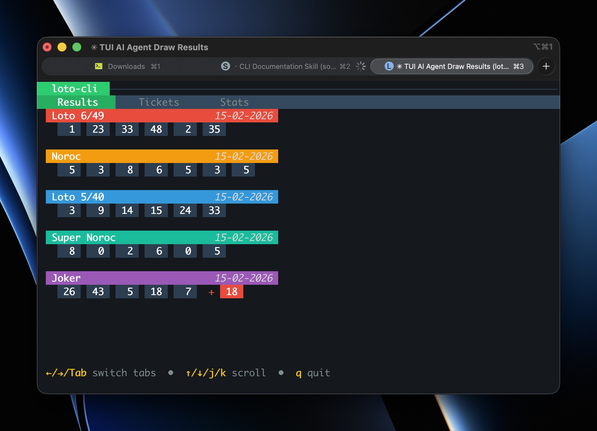
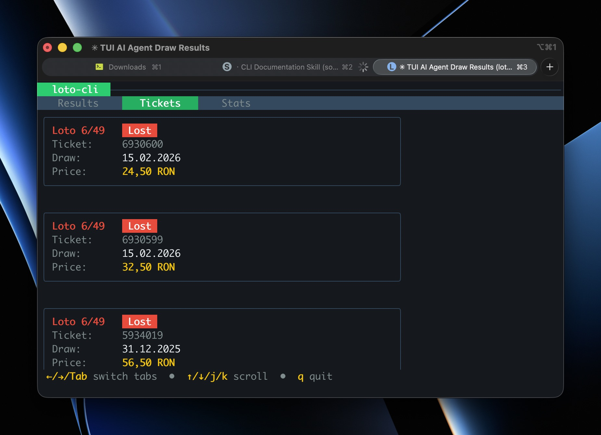
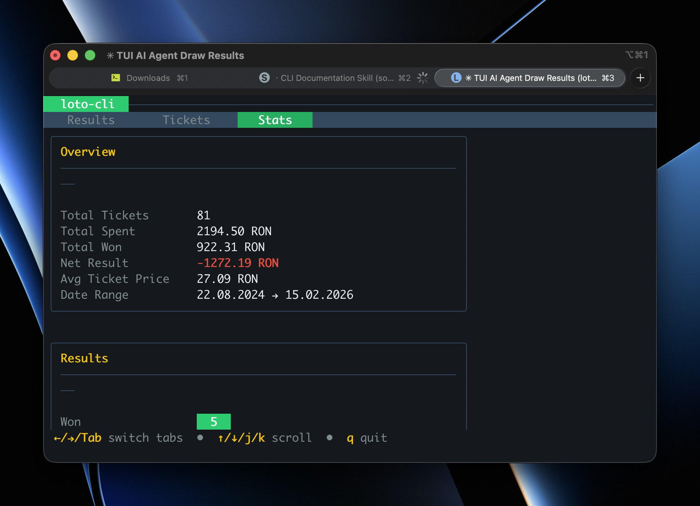

# Loto CLI

A terminal-based interface for [Loteria Romana](https://loto.ro), Romania's national lottery. View extraction results and track your online ticket history.



## Features

- View latest extraction results for all games (Loto 6/49, Loto 5/40, Joker, Noroc, Super Noroc)
- View purchased ticket history with win/loss status and prize amounts
- Ticket statistics (total spent, total won, net result, win rate, per-game breakdown)
- Interactive TUI mode with tabbed interface (Results, Tickets, Stats)
- Cookie persistence for faster logins
- Single binary, no runtime dependencies

## Installation

### macOS (Homebrew)

```bash
brew install rursache/tap/loto-cli
```

### Windows / Linux / macOS (Go)

```bash
go install github.com/rursache/loto-cli@latest
```

### Build from Source

```bash
git clone https://github.com/rursache/loto-cli.git
cd loto-cli
go build -o loto-cli .
./loto-cli          # run the built binary
```

## Screenshots




## Configuration

On first run, the CLI creates a config at `~/.config/loto-cli/config.json`:

```json
{
  "email": "your_email@example.com",
  "password": "your_password",
  "user_agent": "Mozilla/5.0 ..."
}
```

| Field | Required | Description |
|-------|----------|-------------|
| email | Yes | bilete.loto.ro login email |
| password | Yes | bilete.loto.ro password |
| user_agent | No | Custom HTTP user agent string |

> **Note:** The `results` command works without credentials. Only `tickets`, `stats`, and `tui` require authentication.

## Usage

### Interactive TUI Mode

```bash
loto-cli
```

Navigate with keyboard:
- `←` `→` / `Tab` / `1` `2` `3` - Switch between tabs
- `↑` `↓` / `j` `k` - Scroll content
- `q` - Quit

**Tabs:** Results | Tickets | Stats

### CLI Commands

```bash
loto-cli results    # Latest extraction results (no auth required)
loto-cli tickets    # Your ticket history
loto-cli stats      # Ticket statistics (spent, won, win rate, etc.)
loto-cli config     # Print config file path
```

### Global Options

```bash
loto-cli help       # Show help
loto-cli version    # Show version
```

### Examples

```bash
# View latest results
loto-cli results

# Pipe tickets to grep
loto-cli tickets | grep "Won"

# View spending statistics
loto-cli stats
```

## Requirements

- Romanian IP address (the site geo-blocks non-Romanian IPs)
- A [bilete.loto.ro](https://bilete.loto.ro) account (for ticket history)

## AI Skills

This project provides a "skill" for agentic AI tools, allowing AI assistants to interact with Loteria Romana on your behalf:

- **GitHub**: [skill folder](https://github.com/rursache/loto-cli/tree/master/skill)

## License

MIT License - see [LICENSE](LICENSE) for details
